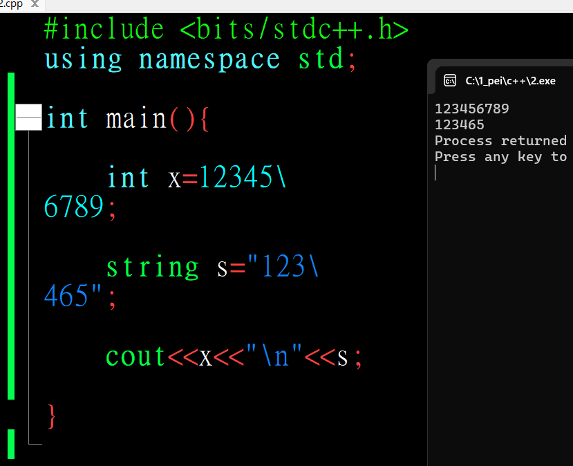
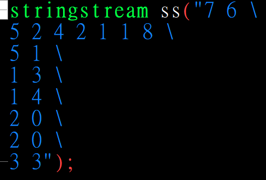

# 考前必看
## 注意long long！！！
>保險起見，每一題最後int 都要轉成long long(除了main)

## codeblocks使用技巧

???已熟記
    ### 換行反斜線「\」不能tab

    {width=50%}

    > 可以配合懶人法使用

    > 注意!!在```\```之前要空格，不然會黏在一起變成：  
    > 原本：7 6 5 2 4 2 1 1 8 5 1 1 3 1 4 2 0 2 0 3 3  
    > 變成：7 65 2 4 2 1 1 85 11 31 42 02 03 3

    {width=50%}


### 尋找與取代 ctrl + R
> ctrl + R

### 多行註解Ctrl+Shift+C / Ctrl+Shift+x

## 易忘英文

### 資料型態

#### istringstream cin(" ");
> istringstream cin("5 17 \
> 5 5 8 3 10");

### STL

#### priority_queue
> 優先駐列

#### multiset
> 多元素set(會排序)

#### unordered_set
> 不排序set(單元素)

#### unordered_multiset
> 不排序且多重元素

#### priority_queue
> [優先駐列](https://hackmd.io/@peicpp/rJDZ4R4WA)

## [prev_permutation/next_permutation](https://hackmd.io/@peicpp/Sk3SU6VZ0/https%3A%2F%2Fhackmd.io%2F%40peicpp%2FSyqZ-8LZ0)

> 排列  
> prev_permutation(v,v+n)

## [isdigit(字元)/isalpha(字元)](https://hackmd.io/@peicpp/Sk3SU6VZ0/https%3A%2F%2Fhackmd.io%2F%40peicpp%2FBk2DcbO-R)
> 數字、字母判斷

## [toupper(字元)/tolower(字元)](https://hackmd.io/@peicpp/Sk3SU6VZ0/https%3A%2F%2Fhackmd.io%2F%40peicpp%2FHJ6p-dGSA)
> 大小寫轉換

## priority_queue
> 優先柱列

## [陣列](https://hackmd.io/@peicpp/HyK_fR4ZA)

### 取字串長度(strlen)

### 字串轉數字(atoi)

### 複製(strcpy)

### 字串比大小(要使用strcmp)
